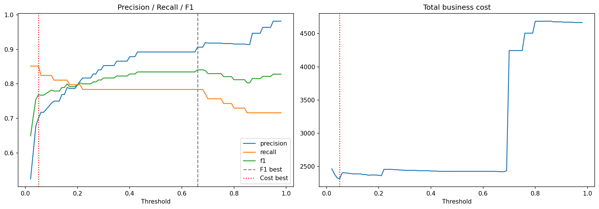
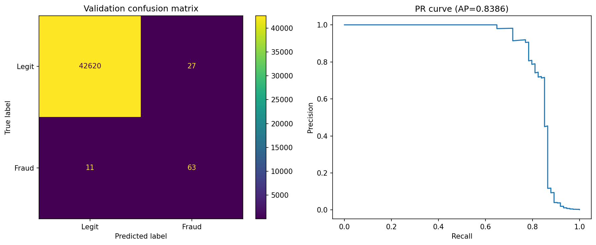
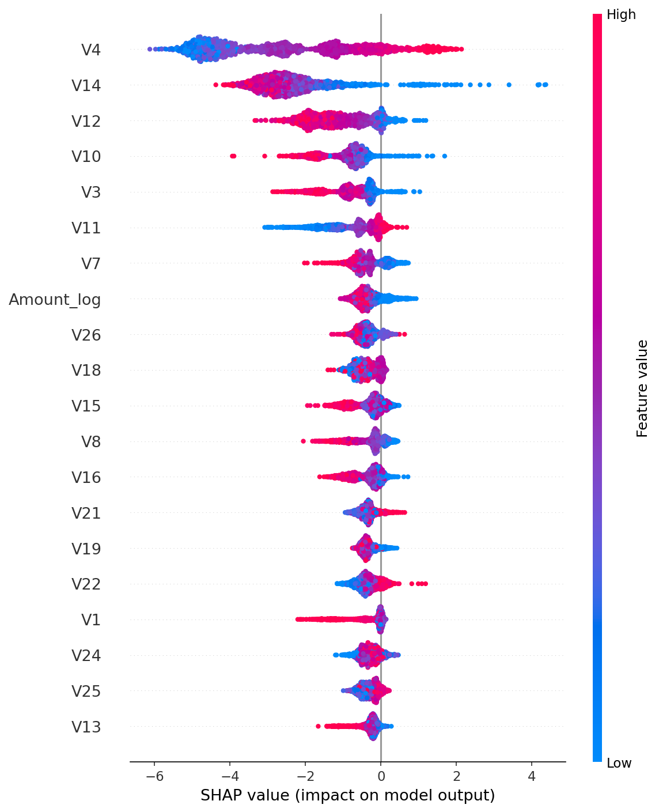

# Credit Card Fraud Detection

End-to-end ML system: data cleaning, feature engineering, imbalance handling,
Optuna tuning, cost-based threshold, SHAP, drift monitoring, FastAPI + Docker.

## Results (held-out test set)

| Metric | Score |
|---|---|
| PR-AUC | 0.848 (95% CI 0.760 - 0.916) |
| ROC-AUC | 0.970 |
| Precision | 0.733 |
| Recall | 0.851 |
| F1 | 0.788 |

Best model: XGBoost, decision threshold 0.05 (chosen by business cost).

## Plots

## Structure
    notebooks/    training notebook
    deployment/   FastAPI app, Dockerfile, model files, API tests
    reports/      metrics, model comparison, threshold table
    plots/        evaluation plots
    artifacts/    metadata, tuned parameters, drift reference

## Run the API
    cd deployment
    docker build -t fraud-api .
    docker run -p 8000:8000 fraud-api
Docs: http://localhost:8000/docs

## Dataset
[ULB Credit Card Fraud](https://www.kaggle.com/datasets/mlg-ulb/creditcardfraud) (not included in repo).

## Limitations
- Public 2013 dataset with PCA-anonymized features
- Review cost used in the threshold is an assumption
- No authentication, CI/CD, or automatic retraining
